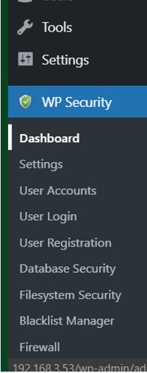
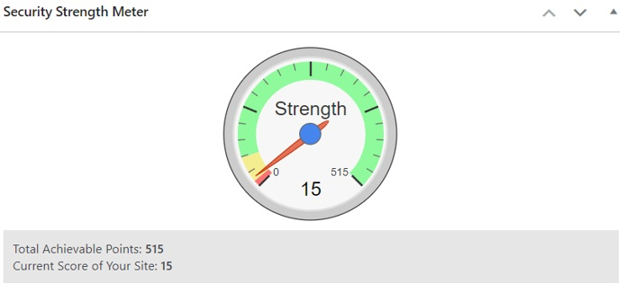
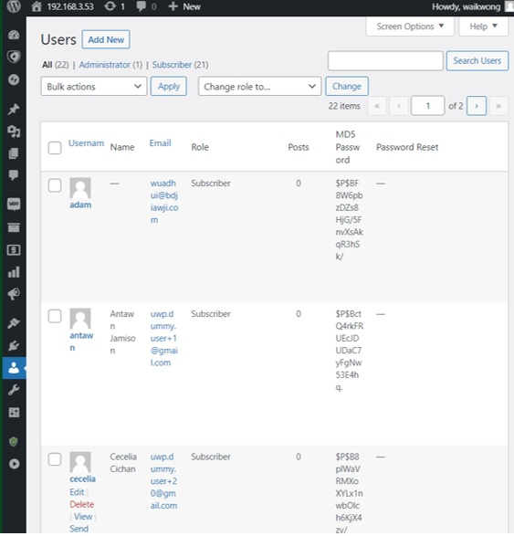

# Security Assessment
1.	Scan the database configuration

•	After the installation process, you should click sttings -> wpSecurity->Dashboard

•	You will see the security strength meter after getting in the dashboard. That meter is used to show the current security level of the WordPress database.

•	If you want to check the user information, you should click the user -> all users. All the user information data will in there(for example their user name email and password).

