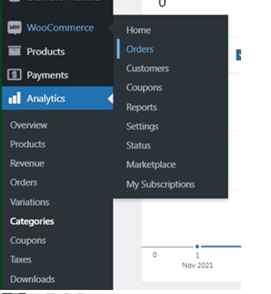
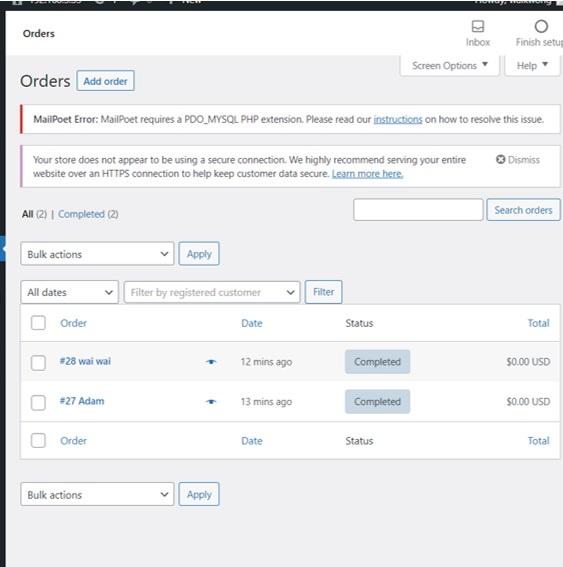
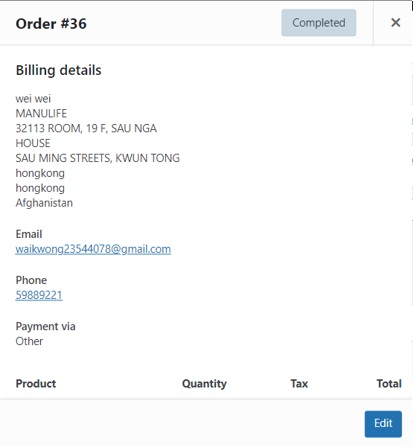

# 2.	Identification of sensitive data/user's PII

•	If you want to check the sensitive information in the woocommerce/wordpress database, you could click the woocommerce -> order.

•	Inside the orders page there provoid the information of the order

•	Chose one order and clink it, you discover that there include some user personal identifiable information for instance the user name, email address, phone number and the address of the client.

