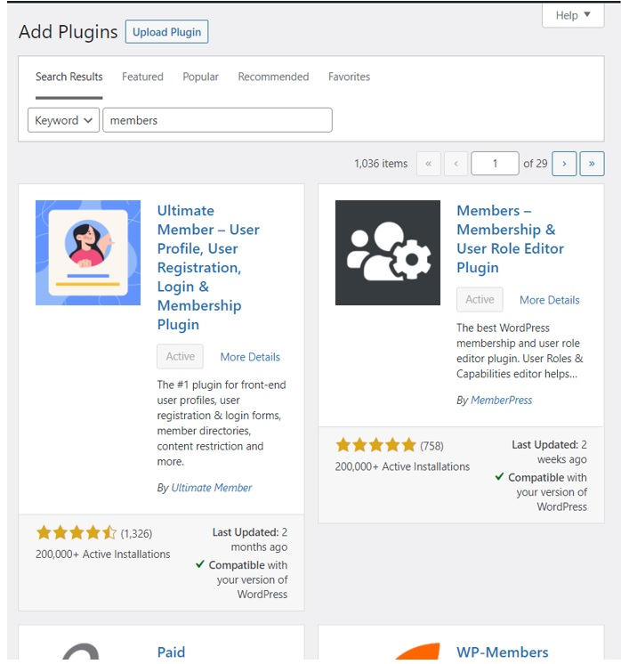

# 3.Analysis of database roles and privileges

•	In the Dashboard, you click the user -> all user to checks the role of the user. (admin, subscriber, author, contributor, editor and shop manager)

•	In the Dashboard, you click the ultimte user -> user role to checks the privileges of the role can do. (For instance administrator can edit or control all file in the database)

